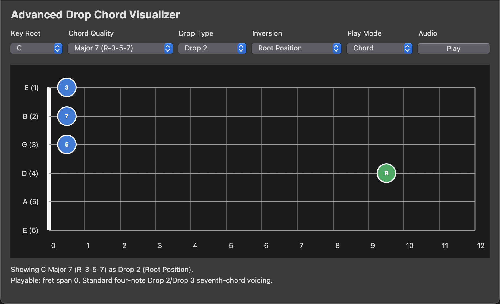
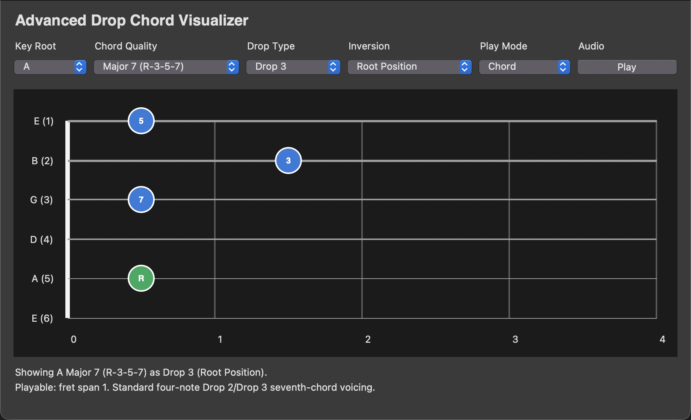

# guitar_chords_viewer

Native Python desktop app for viewing guitar drop chord voicings and CAGED shapes.

Try the browser demo on GitHub Pages: https://oscarsg29.github.io/guitar_chords_viewer/demo/

Run it from the repository root:

```bash
python3 guitarChordsViewer.py
```

## Screenshots





See `PROJECT_STRUCTURE.md` for the folder layout and `SETUP_CHECKLIST.md` for verification commands.
